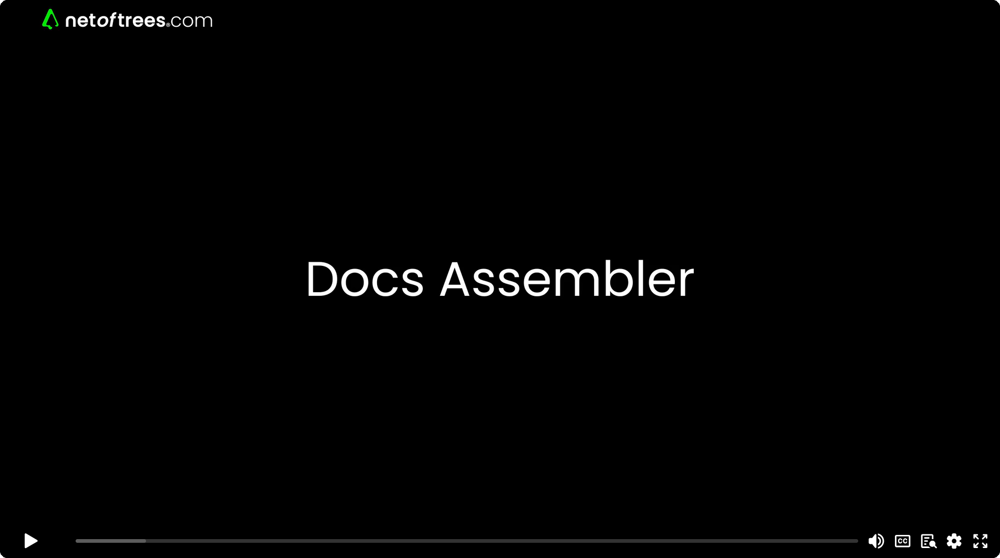
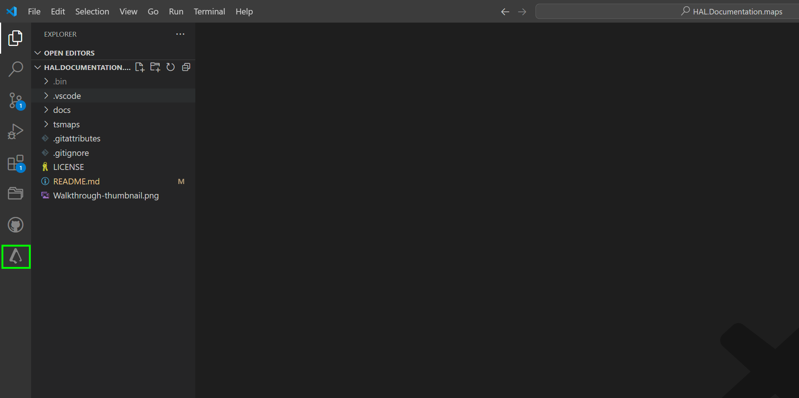
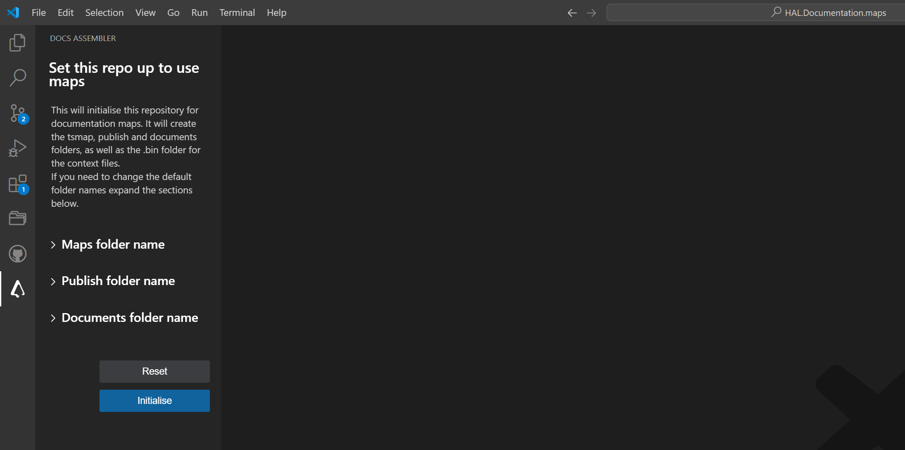

# Docs Assembler example repo

This folder contains a fork of the HAL Robotics documentation repo, initialised to use maps.   
It serves as a good example for simple use cases - as there are only shared variables and steps, no linked maps. 
#### BE AWARE: This is not the current version of HAL Robotics documentation - see below

## Docs Assembler - build documentation like Lego

- Reuse of interchangeable **blocks** and **fragments** of text.
- A [strategy](#notes) that mirrors **classes** and **variables** in programming.
- Streamlines development and simplifies editing on growing or complex systems.
  

This is an experimental port from a c# server/database application - to a GitHub repo/extension. A concept driven by transformational conversations with a robotics firm - [HAL Robotics](https://hal-robotics.com), so their documentation could be edited as markdown files, stored in their git repo, and compiled into manuals, diagnostic/solution walkthroughs, manufacturer specific guides etc - all based on a policy of ***edit once - update globally*** - like with **classes** and **components** in code.

The vscode extension Docs Assembler can be downloaded here:
[vscode marketplace - docs assembler](https://marketplace.visualstudio.com/items?itemName=netoftrees.documentation-assembler)  
[team@netoftrees.com](mailto:team@netoftrees.com)  
[www.netoftrees.com](https://www.netoftrees.com/)

## Initialise

1. Open vscode [download vscode here](https://code.visualstudio.com/download).
2. Install the Docs Assembler extension on vscode [download Docs Assembler here](https://marketplace.visualstudio.com/items?itemName=netoftrees.documentation-assembler).
3. Clone this repo to your computer.
4. In the vscode Activity Bar click the Docs Assembler icon - _outlined in green_.

5. Click the Initialise button to create the cache folders.

6. The repo is now ready to use.
 

___________________________________________

## For more information on HAL Robotics:

website:
[hal-robotics.com](https://hal-robotics.com/)  
documentation:
[docs.hal-robotics.com](https://docs.hal-robotics.com/)  
documentation repo:
[github.com/HALRobotics/HAL.Documentation](https://github.com/HALRobotics/HAL.Documentation)

